# Personal Website

A modern, responsive personal portfolio website built with React.js featuring interactive components, dark mode support, and a comprehensive showcase of professional experience, projects, and achievements.

## 📚 Documentation

Detailed documentation is available in the `docs/` folder:

- [**Setup Guide**](docs/setup_guide.md): Installation, prerequisites, and troubleshooting.
- [**Architecture**](docs/architecture.md): Project structure, key components, and data management.
- [**Customization**](docs/customization.md): How to update content (resume, sports, projects) and styling.
- [**Deployment**](docs/deployment.md): Building for production and deploying to GitHub Pages.
- [**Contributing**](docs/contributing.md): Guidelines for contributing to the project.

## 🚀 Quick Start

1. **Clone the repository**
   ```bash
   git clone <repository-url>
   cd personal-site
   ```

2. **Install dependencies**
   ```bash
   npm install
   ```

3. **Start development server**
   ```bash
   npm start
   ```

## 🗂 Repository Structure

```mermaid
graph TD
    ROOT["🗂 personal-site/"]

    ROOT --> SRC["📁 src/"]
    ROOT --> PUBLIC["📁 public/"]
    ROOT --> DOCS["📁 docs/"]
    ROOT --> FUNC["📁 functions/"]
    ROOT --> GH["📁 .github/workflows/"]
    ROOT --> CFG["⚙️ Config Files\npackage.json · tailwind.config.js\nbabel.config.js · postcss.config.js · jest.config.js"]

    SRC --> APPJS["App.js · index.js\n(entry & routes)"]
    SRC --> COMP["📁 components/"]
    SRC --> PGS["📁 pages/\n14 page components"]
    SRC --> DATA["📁 data/"]
    SRC --> LAY["📁 layouts/\nMain.js"]
    SRC --> CTX["📁 context/\nThemeContext.js"]
    SRC --> CSS["📁 static/css/\nSCSS modules"]

    COMP --> C_T["Template/\nNavigation · Footer · Sidebar\nHamburger · Logo · ScrollToTop"]
    COMP --> C_S["Sports/\nSportsV2 · Statistics · Modal · Utils"]
    COMP --> C_TK["Treks/\nTimeline · Statistics · Modal"]
    COMP --> C_R["Resume/\nExperience · Education · Skills · Certs"]
    COMP --> C_O["About · Books · Challenges · Contact\nIndex · Instagram · Now · Projects"]

    DATA --> D_JS["books.js · sports.js · treks.js\nprojects.js · contact.js · routes.js\n100DaysToOffload.js · instagram.js"]
    DATA --> D_MD["about.md · now.md · changelog.md"]
    DATA --> D_RES["📁 resume/\ncertifications · degrees · positions · skills"]
    DATA --> D_ST["📁 stats/\npersonal.js"]

    PUBLIC --> P_HTML["index.html\n(OG tags · favicons · meta)"]
    PUBLIC --> P_IMG["📁 images/\nfavicon · sports · treks · projects · insta_posts"]
    PUBLIC --> P_PDF["sanket-tambare-resume.pdf"]

    GH --> W1["node.js.yml\n(CI)"]
    GH --> W2["github-pages.yml\n(Deploy)"]
    GH --> W3["codeql-analysis.yml\n(Security)"]

    DOCS --> DOC1["setup_guide.md · architecture.md\ndeployment.md · customization.md\nfeatures.md · contributing.md"]
```



## 🛠️ Scripts

| Command | Description |
|---|---|
| `npm start` | Start the development server |
| `npm run build` | Build for production |
| `npm run lint` | Run ESLint across the project |
| `npm run deploy` | Build and deploy to GitHub Pages |

## 📄 License

This project is open source and available under the [MIT License](LICENSE).
