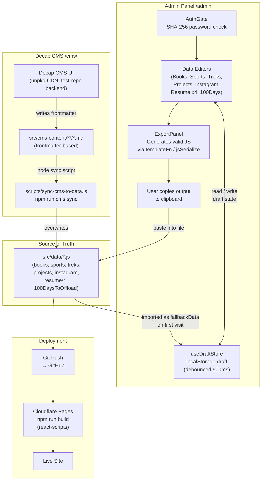

# CMS Data Flow

This document describes how content moves through the system — from static source files, through the admin panel and Decap CMS, back to deployment.

---

## Overview Diagram



---

## Flow Descriptions

### Path A — Admin Panel (direct JS editing)

| Step | What happens |
|------|-------------|
| 1 | User navigates to `/admin`, passes SHA-256 password check (`AuthGate`) |
| 2 | Each editor imports its `src/data/*.js` file as `fallbackData` |
| 3 | `useDraftStore` initialises from `localStorage` (if a prior draft exists) or from `fallbackData` |
| 4 | Every field change is auto-saved to `localStorage` with a 500 ms debounce |
| 5 | User clicks **Export** → `ExportPanel` runs `templateFn(items)` which calls `jsSerialize` to produce a valid JS string (template literals preserved for `PUBLIC_URL` image paths) |
| 6 | User copies the output and pastes it into the corresponding `src/data/*.js` file |
| 7 | User commits and pushes → Cloudflare Pages rebuilds automatically |

### Path B — Decap CMS (Git-based markdown editing)

| Step | What happens |
|------|-------------|
| 1 | User navigates to `/cms/` — Decap CMS loads from unpkg CDN |
| 2 | Local dev uses `test-repo` backend (no OAuth). Production: switch `backend.name` to `github` in `public/cms/config.yml` |
| 3 | Decap writes edits as `.md` files with YAML frontmatter under `src/cms-content/` |
| 4 | Developer runs `npm run cms:sync` → `scripts/sync-cms-to-data.js` reads each `.md` file and overwrites the corresponding `src/data/*.js` |
| 5 | Updated JS files are committed and pushed → Cloudflare Pages rebuilds |

### Path C — Direct file editing (developer workflow)

Developers can always edit `src/data/*.js` files directly. The admin panel and Decap CMS are convenience layers on top of the same static files.

---

## Key Files

| File | Role |
|------|------|
| `src/data/*.js` | Single source of truth for all content |
| `src/components/Admin/AuthGate.js` | Password gate (SHA-256, no backend) |
| `src/hooks/useDraftStore.js` | localStorage persistence with 500 ms debounce |
| `src/components/Admin/ExportPanel.js` | Generates JS export string for copy-paste |
| `src/components/Admin/utils/jsSerialize.js` | Handles `${process.env.PUBLIC_URL}` template literals in image URLs |
| `public/cms/config.yml` | Decap CMS collections config (`test-repo` backend for local dev) |
| `scripts/sync-cms-to-data.js` | Converts Decap markdown frontmatter → `src/data/*.js` |

---

## Data Persistence Model

```
┌─────────────────────────────────────────────────┐
│  Runtime (browser)                              │
│                                                 │
│  localStorage                                   │
│  ├── admin_authenticated   "true"               │
│  ├── theme                 "light" | "dark"     │
│  ├── admin_draft_books     JSON array           │
│  ├── admin_draft_sports    JSON array           │
│  ├── admin_draft_treks     JSON array           │
│  ├── admin_draft_projects  JSON array           │
│  ├── admin_draft_hundreddays  JSON array        │
│  ├── admin_draft_instagram JSON array           │
│  ├── admin_draft_positions JSON array           │
│  ├── admin_draft_degrees   JSON array           │
│  ├── admin_draft_skills    JSON array           │
│  └── admin_draft_certifications  JSON array     │
└─────────────────────────────────────────────────┘

┌─────────────────────────────────────────────────┐
│  Build-time (Node / Cloudflare Pages)           │
│                                                 │
│  src/data/*.js  →  react-scripts build          │
│                 →  static JS bundles            │
│                 →  served from CDN              │
└─────────────────────────────────────────────────┘
```

> **No backend, no database.** All persistence is either `localStorage` (ephemeral draft state) or `src/data/*.js` files committed to git (permanent source of truth).
