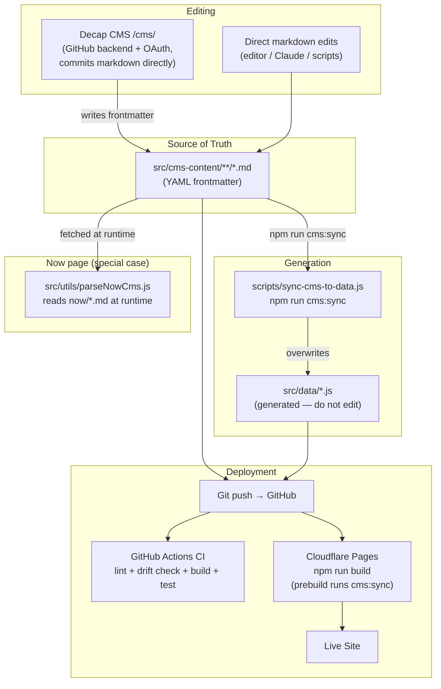

# CMS Data Flow

This document describes how content moves through the system — from Decap CMS or direct markdown edits, through the sync script, to deployment.

**`src/cms-content/**/*.md` is the single source of truth for content.** The JS files in `src/data/` are generated artifacts.

---

## Overview Diagram


```mermaid
flowchart TD
    subgraph SOURCE["Source of Truth"]
        MD["src/cms-content/**/*.md\n(YAML frontmatter)"]
    end

    subgraph EDIT["Editing"]
        DECAP["Decap CMS  /cms/\n(GitHub backend + OAuth,\ncommits markdown directly)"]
        DIRECT["Direct markdown edits\n(editor / Claude / scripts)"]
    end

    subgraph SYNC["Generation"]
        SYNCJS["scripts/sync-cms-to-data.js\nnpm run cms:sync"]
        JS["src/data/*.js\n(generated — do not edit)"]
    end

    subgraph NOW["Now page (special case)"]
        PARSE["src/utils/parseNowCms.js\nreads now/*.md at runtime"]
    end

    subgraph DEPLOY["Deployment"]
        GIT["Git push → GitHub"]
        CI["GitHub Actions CI\nlint + drift check + build + test"]
        CF["Cloudflare Pages\nnpm run build\n(prebuild runs cms:sync)"]
        LIVE["Live Site"]
    end

    DECAP -->|"writes frontmatter"| MD
    DIRECT --> MD
    MD -->|"npm run cms:sync"| SYNCJS
    SYNCJS -->|"overwrites"| JS
    MD -->|"fetched at runtime"| PARSE
    MD --> GIT
    JS --> GIT
    GIT --> CI
    GIT --> CF
    CF --> LIVE
```

---

## Flow Descriptions

### Path A — Decap CMS (`/cms/`)

| Step | What happens |
|------|-------------|
| 1 | User navigates to `/cms/` and authenticates via GitHub OAuth (Sveltia auth worker) |
| 2 | Decap writes edits as `.md` files with YAML frontmatter under `src/cms-content/` and commits to `main` |
| 3 | Cloudflare Pages rebuilds; the `prebuild` hook runs `cms:sync`, so the new content is in the deployed bundle |
| 4 | To keep the repo consistent, run `npm run cms:sync` locally and commit the regenerated `src/data/*.js` (CI's drift check will remind you) |

### Path B — Direct markdown edits

Edit or add files under `src/cms-content/` directly (this is the workflow CLAUDE.md prescribes for agents), then:

```bash
npm run cms:sync   # regenerate src/data/*.js
git add src/cms-content src/data && git commit && git push
```

### The Now page

`/now` skips the generated files entirely: `src/utils/parseNowCms.js` fetches `src/cms-content/now/meta.md` and `now/months/*.md` at runtime and parses the frontmatter in the browser.

### Guard rails

- **CI drift check**: the CI workflow runs `npm run cms:sync && git diff --exit-code src/data`. Any hand edit to a generated file, or a markdown change committed without its regenerated JS, fails CI.
- **Deterministic output**: the sync script sorts directory listings and entry ids, so the same markdown always produces byte-identical JS on any machine.
- **Recovery**: `scripts/seed-cms-content.js [collection]` regenerates markdown *from* the JS files — only needed if a JS file somehow got ahead of the markdown.

---

## Key Files

| File | Role |
|------|------|
| `src/cms-content/**/*.md` | Single source of truth for all content |
| `src/data/*.js` | Generated artifacts imported by pages |
| `public/cms/config.yml` | Decap CMS collections config (GitHub backend) |
| `scripts/sync-cms-to-data.js` | Converts markdown frontmatter → `src/data/*.js` |
| `scripts/seed-cms-content.js` | Recovery tool: JS → markdown |
| `src/utils/parseNowCms.js` | Runtime markdown loader for the Now page |

---

## Data Persistence Model

```
┌─────────────────────────────────────────────────┐
│  Runtime (browser)                              │
│                                                 │
│  localStorage                                   │
│  └── theme                 "light" | "dark"     │
└─────────────────────────────────────────────────┘

┌─────────────────────────────────────────────────┐
│  Build-time (Node / Cloudflare Pages)           │
│                                                 │
│  src/cms-content/*.md → cms:sync (prebuild)     │
│                       → src/data/*.js           │
│                       → react-scripts build     │
│                       → static JS bundles (CDN) │
└─────────────────────────────────────────────────┘
```

> **No backend, no database.** All content is markdown committed to git; the only browser persistence is the theme preference.
