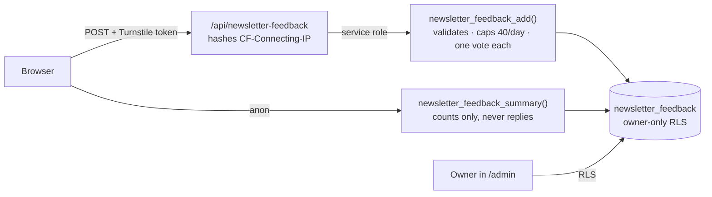

# The Newsletter

A monthly letter at `/newsletter`: everything that happened in a month — races,
treks, books, blog posts, short posts, projects — gathered from the site's own
archive, plus a hand-written note on what it meant. Readers can react, vote,
rate, write back, share any part of it as an image, and ask the archive
questions about it.

This document is the reference for the feature and the source for presenting
it. It covers what it is, how the pieces fit, why it is built this way, and what
to copy if you want one.

---

## 1. What and why

**The problem.** The site already logs everything: a race goes into `sports`, a
fort into `treks`, a book into `books`, a thought into `microblog`. A log is not
a memory. Nobody reads a table of 50 races; races blur into each other and books
into shelves. And `/now` — the page that was meant to tell the story of a month
— had become a retyped copy of what the tables already held.

**The idea.** Once a month, the site gathers that month into one issue, and the
author adds a letter about what it meant. The machine does the remembering; the
human does the meaning.

**What a reader gets**

| | |
|---|---|
| `/newsletter` | What the letter is and why it exists, the latest issue, every issue by year |
| `/newsletter/2026-09` | One month: headline, three numbers, the letter, a calendar of the month, each section, feedback, a chat pinned to the issue, "months like this" |
| Two looks | **Letter** in the atlas theme (a stamped envelope that opens into a handwritten letter and postcards). **Magazine** in the classic theme (photo cover, drop cap, numbered spreads, pull-quote) |
| Share | A per-issue link card (1200×630) for WhatsApp / X / LinkedIn, a portrait "my month" image (1080×1350), an image per section, an image per item |
| Talk back | Emoji reactions per section, a poll, a 1–5 rating with "the part worth reading", a private reply |
| Ask | "How did the Pune Half go?" — a chat answering from this issue and everything it links to |
| Email | "Copy for Substack" in `/admin` pastes the issue into Substack, which emails subscribers |

---

## 2. The monthly workflow

```mermaid
sequenceDiagram
  actor S as Sanket
  participant C as Claude (/newsletter skill)
  participant N as npm run newsletter:draft
  participant DB as Supabase
  participant A as /admin
  participant R as Readers

  S->>C: /newsletter 2026-09
  C->>N: collect the month
  N->>DB: read blogs, sports, books, treks, microblog
  N->>DB: merge into now_months (idempotent)
  N->>DB: upload card → media/og/newsletter-2026-09.png
  N-->>C: brief.json (facts only)
  C->>C: write headline + letter + poll from the brief
  C->>N: --note 2026-09.md
  N->>DB: headline, note, poll; re-render card
  C-->>S: review link
  S->>A: review, edit, Publish on save
  S->>A: Copy for Substack → paste → send
  R->>DB: read /newsletter/2026-09, react, vote, reply
```

In words:

1. `/newsletter 2026-09` in Claude Code (or `npm run newsletter:draft -- 2026-09`
   by hand).
2. The script collects every dated item of the month into the row, renders the
   share card, and writes a brief.
3. Claude writes the letter **from the brief only** and runs the script again
   with `--note`.
4. You review at `/admin/now/months`, press **Publish on save**, then **Copy for
   Substack**.

Nothing is published by a machine. The script never touches `published_at`.

---

## 3. Script, prompt, or both? (the decision)

Three options were on the table:

| | A script only | A prompt that makes Claude write an HTML page each month | **Script + skill (chosen)** |
|---|---|---|---|
| Data | Exact | Retyped by a model — can drift or invent | Exact |
| Design | One design | A new design every month | One design |
| Share meta / crawlers | Automatic | Hand-written tags, like `writing-ledger.html` | Automatic |
| `/ask` indexing | Automatic | None | Automatic |
| Re-runnable | Yes | Produces a different page each run | Yes |
| The letter | You type it | Model writes it | Model drafts it from facts; you edit |

The rule that came out of it: **deterministic pipeline for data, AI for prose
only.** The script decides *what happened*; the model only decides *how to say
it*, and is given nothing but the script's brief to say it from. A page is never
generated — one design renders every issue from its row.

---

## 4. Entity map

```mermaid
flowchart LR
  subgraph Archive["Content tables (single source of truth)"]
    SP[sports]
    TR[treks]
    BK[books]
    BL[blogs]
    MB[microblog]
  end

  subgraph Issue["One issue = one now_months row"]
    NM["now_months<br/>sections (snapshot)<br/>slug · headline · note · poll<br/>published_at · card_url"]
  end

  SP & TR & BK & BL & MB -->|"mergeMonthRecords()<br/>+ ref {type,id}"| NM
  NM -->|issueModel()| PG["/newsletter/:slug<br/>Letter | Magazine"]
  NM -->|current month| NOW["/now"]
  NM -->|scripts/ask-sources/now.mjs| CC[content_chunks]
  CC -->|"focus {type:'now', id, refs}"| ASK["/api/ask"]
  NM -->|satori, build time| CARD["Storage<br/>media/og/newsletter-YYYY-MM.png"]
  CARD --> MW["functions/_middleware.js<br/>og:image"]
  PG -->|"/api/newsletter-feedback"| FB["newsletter_feedback<br/>(owner-only)"]
  FB -->|"newsletter_feedback_summary()<br/>counts only"| PG
  NM -->|issueToHtml()| SUB[Substack]
```

**Why the issue is a `now_months` row and not a new table.** `/now` already had
a row per month whose `sections` blob was already a frozen copy of the month
(the admin "Pull records" button copies content rows into it). A separate
`issues` table would have been a second copy of the same month. Migration `0032`
added only what makes a month publishable: `slug`, `headline`, `note`, `poll`,
`published_at`, `card_url`. The twelve months already on `/now` became the
first twelve issues. `/now` now shows only the current month.

**Refs are what connect an issue back to the archive.** Every row the script
merges carries `ref: { type, id }` — the archive row it came from. Refs are what
let an item link to its own page, be shared with its own image, and be pinned
into an `/ask` question. Re-running the script backfills refs onto rows that
were typed by hand, matched by id, url or title.

---

## 5. Converging the data

The four sources do not agree on anything, and `src/lib/monthDigest.js` is the
one place that reconciles them:

| Source | Date column | Format |
|---|---|---|
| blogs | `blog_date` | `YYYY-MM-DD` |
| treks | `date` | `DD-MM-YYYY` — day first, which `new Date()` misreads |
| sports | `date` | `Month DD, YYYY` |
| microblog | `date` | Postgres `date` |
| books | `date_finished` | trusted only when `date_precision = 'day'`; else the date added |

`parseContentDate` normalises each to a local calendar date (never
`toISOString()`, which is UTC and rolls an IST evening back a day), and
`itemMonthKey` buckets it into `YYYY-MM`.

Then `src/lib/nowAutofill.js`:

- **`collectMonthRecords`** maps each source row into the section shape the
  issue renders (`sports` → `running`, `treks` → `events`, …).
- **`isDuplicate`** matches by archive id, then ref, then url, then title — so
  an item typed by hand and the same item pulled from the archive are one item.
  Races also match by `sameRace()`: the name's core (years, "Kms", "run"
  stripped) plus the distance, because a race typed on `/now` ("Tata Ultra
  Marathon", 50) and its `sports` row ("Tata Ultra Marathon 2026", "50 Kms")
  share neither title nor link. The typed row keeps its words and adopts the
  archive's `ref` and real date.
- **Bulk imports are not reads.** Five or more books added on the same day are
  an import, skipped unless they carry a finish date with day precision — 47
  books imported on 13 June 2026 had made June look like 37 books read.
- **`mergeMonthRecords`** is what the script writes: idempotent, never
  duplicates, backfills refs.

And `src/lib/newsletterIssue.js` turns a row into everything a page needs —
ordered sections, the three headline numbers (a zero is omitted, never shown),
the day-by-day calendar, the refs, the ask starter questions, the pull-quote and
the Substack HTML. Every consumer — both layouts, the share cards, the OG card,
the middleware, the `/ask` source — reads an issue through it, so they cannot
disagree about what a month held.

---

## 6. Share cards

**The link card is rendered at build time, never at request time.** Cloudflare
Workers Free allows 10 ms of CPU per request and a satori render costs ~400 ms;
an earlier on-demand renderer returned error 1102 in production and links
unfurled with no image at all (see `docs/og-cards.md`). So
`npm run newsletter:draft` renders the issue's card under Node with the same
`pageCard` layout as every other card and uploads it to Storage as
`media/og/newsletter-<slug>.png`. The flat name matters: `isCardImage` matches
`/og/<name>.png`, so the middleware declares `og:image:width/height` for it.

The card's figure is **the month itself** — a wall calendar with the active days
lit — over a duotoned race or trek photo when the month has one. The hub card
is an envelope. Per the site's card rules: headline ≤ 6 words, at most three
numbers, one accent (amber), WebP skipped because resvg cannot draw it.

The portrait and per-section images reuse the existing share-image editor
(`src/components/share/`) through two new adapters in `shareCardConfig.js`;
per-item images reuse each item's own existing adapter.

---

## 7. Feedback, and privacy



- **The table is owner-only.** An anon select policy would let anyone read every
  private reply. The public reads counts through a `SECURITY DEFINER` function
  that never returns a reply.
- **Writes go through the edge.** Postgres cannot see a client's IP through
  PostgREST, so a per-visitor cap would be meaningless if the browser could pick
  its own identity. The Pages Function hashes the real IP (salted, truncated —
  enough to count, not enough to reverse) and calls the write RPC with the
  service role, which is the only role allowed to.
- **Votes are one per visitor** — a new poll vote or rating replaces the old
  one; a repeated reaction is a no-op. localStorage remembers what this browser
  did so the buttons show it; that is courtesy, not enforcement.
- **No email, no account.** A reply is a message and an optional name.
- **Drafts stay private.** RLS lets the public read a month only when it is
  published or is the current month (which `/now` shows). The issue page shows
  an unpublished month only to a signed-in viewer, as a preview.

---

## 8. Ask about this issue

`/ask` already indexed `now_months`. Each issue now indexes as a letter chunk
(headline, the month's numbers, the note) plus one chunk per section, at its own
`/newsletter/<slug>` url.

The issue page embeds the chat with a **focus**:
`{ type: "now", id, refs: [the issue's archive rows] }`. The worker
(`functions/api/ask.js`) reads those chunks straight out of `content_chunks` by
key, in parallel with the normal search, and puts them ahead of whatever search
found (`withFocus` in `src/lib/askRetrieval.js`). Without it, "how did the race
go?" searches the whole archive for "race" and answers about the wrong one. The
starter chips are built from the issue itself (`issueQuestions`), so each one
names something the archive can actually answer.

---

## 9. File map

| Piece | File |
|---|---|
| Schema, RLS, feedback RPCs | `supabase/migrations/0032_newsletter.sql` |
| Issue model, stats, calendar, Substack HTML | `src/lib/newsletterIssue.js` |
| Month collection + ref backfill | `src/lib/nowAutofill.js`, `src/lib/monthDigest.js` |
| The draft script | `scripts/newsletter-draft.mjs` (`npm run newsletter:draft`) |
| The Claude skill | `.claude/skills/newsletter/SKILL.md` |
| Card renderer (shared with og:fallbacks) | `scripts/lib/og-render.mjs`, `src/lib/og/layouts/page.js` (`FIGURES.newsletter`), `src/lib/og/model.js` (`issueCardModel`) |
| Pages | `src/pages/Newsletter.js`, `src/pages/NewsletterIssue.js` |
| Layouts and parts | `src/components/Newsletter/` |
| Feedback endpoint + client | `functions/api/newsletter-feedback.js`, `src/lib/api/newsletter.js` |
| Crawler meta | `functions/_middleware.js`, `buildNewsletterMeta` in `src/data/pageMeta.js` |
| Ask focus | `src/lib/askRetrieval.js`, `functions/api/ask.js`, `scripts/ask-sources/now.mjs` |
| Admin | `src/pages/admin/now/NowMonthEditor.js`, `src/pages/admin/now/IssuePanel.js` |

---

## 10. What to adopt if you build one

These are the decisions that made this cheap, in order of how much they matter:

1. **Keep one source of truth, and derive — never retype.** Every item in an
   issue already existed as a row. The newsletter is a view over the archive,
   not a second archive. If your content lives in five tools, put it in one
   place first; that is the real work.
2. **Freeze a snapshot.** An issue stores a copy of its month. Editing a race
   next year does not rewrite last September's letter, and a deleted row does
   not leave a hole in it.
3. **Machines for facts, people (or models) for meaning.** A script collects;
   a model drafts prose from the script's output and nothing else; a person
   reviews and publishes. Never let a model be the source of a number.
4. **Normalise dates at one choke point.** Every content type stores dates
   differently. One function, tested, in local time.
5. **Make every script idempotent.** Re-running `newsletter:draft` is always
   safe, so fixing a month is "add the missing race, run it again".
6. **Render images at build time.** Social cards are static files; an edge
   function rendering them on demand will time out on free tiers.
7. **Design feedback for privacy first.** Owner-only storage, counts-only public
   reads, identity hashed at the edge, no accounts, no emails.
8. **Link items back to their source.** A `ref` on every item is what makes
   sharing, linking and question-answering work later.
9. **One model, two presentations.** The Letter and the Magazine differ
   completely in look and share one `issueModel()`. Presentation is cheap when
   the model is right.

---

## 11. Next opportunities

Not built yet, roughly in order of value for effort:

- **Listen to this issue** — the site already has `ReadAloud`.
- **Month-over-month deltas** — "3 more races than August" from two
  `issueStats` calls.
- **On this day, last year** — `0025`'s on-this-day RPC.
- **Goals and check-ins** — next month's intentions in the letter, checked in
  the next issue.
- **A December year-in-review issue** built from the twelve issues.
- **A passport stamp** in the atlas for reading an issue.
- **A map of the month's places** — races and treks have places; the globe
  exists.
- **An RSS feed of issues** for readers who do not want email.
- **A GitHub Action on the 1st** that runs `newsletter:draft` so the month is
  collected before you sit down to write.

## 12. Known limits

- **The current month's draft letter is readable over raw REST** before it is
  published, because RLS must let the public read the current month for `/now`.
  Publishing follows writing within hours, so it is accepted.
- **Card URLs do not change on re-render.** WhatsApp and others cache unfurls by
  URL; a re-rendered card may take a while to show on a link already shared.
- **The feedback cap is fixed** at 40 writes per visitor per day in the SQL.
